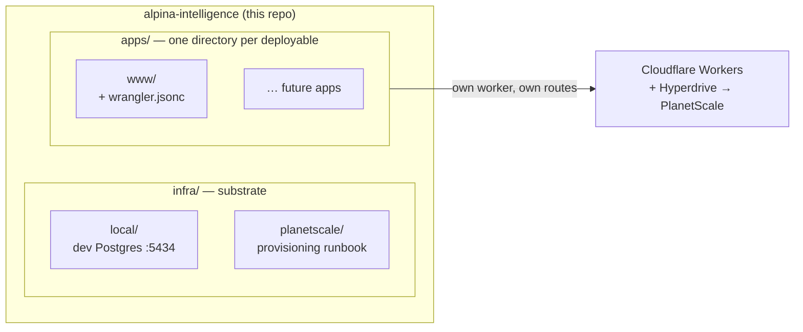

# Alpina Intelligence — monorepo

All projects in one repo: the shared infrastructure substrate, the apps that run on it,
and the libraries they share. HTTP apps deploy to Cloudflare Workers against
Cloudflare-billed PlanetScale Postgres; there is no VPS (ADR-0006) and always-on compute
is Cloudflare's to provide.

This lineage is a **deliberate restart**: the previous stack (the "UIP" monorepo — a Bun
workspace with every app, one big `docker-compose.yml`, and five deploy workflows) was
torn down. Its history is intact at the tag **`archive/uip-final`**, and the parts worth
learning from are copied into [`docs/reference/`](docs/reference/). Projects are ported
out of that tag into the layout below one at a time.

## Layout

```
infra/         # substrate: local postgres, planetscale (deployed), terraform (planned)
apps/          # deployable units, ANY language — each owns its wrangler.jsonc (ADR-0003)
packages-ts/   # shared TypeScript, consumed as source (Bun workspace)
packages-py/   # shared Python, alpina.* namespace (uv workspace) — created on first need
docs/          # architecture, ADRs, reference material from the previous stack
```

Apps are grouped **by deployable unit, not language** ([ADR-0002](docs/adr/0002-repo-layout.md)):
a TanStack Start app sits next to a Python service in `apps/`. TS members belong to the
Bun workspace rooted here; Python members to the uv workspace rooted here.

## The boundary

The substrate — the things every project shares and exactly one person should be able to
change — lives in `infra/`. Each app owns everything specific to itself:

| Concern | Owner |
| --- | --- |
| Local dev Postgres — container, version, provisioning | **`infra/`** |
| Deployed data tier — PlanetScale cluster, Hyperdrive configs | **`infra/planetscale/`** runbook |
| Cloudflare DNS, Access — via Terraform | **`infra/`** (planned) |
| An app's worker config, routes, schema, migrations, seed data | **`apps/<name>/`** |

The load-bearing rule: **the deployed Postgres superuser password never leaves the
substrate tier.** It was never repo membership that enforced this — it's credential
scoping: the admin URL lives in Bitwarden, real SQL goes through `psql`, the MCP server is
insights-only, and no app or CI environment ever holds it
([ADR-0001](docs/adr/0001-monorepo.md), [ADR-0005](docs/adr/0005-deployed-data-tier.md)).

Adding an app is one directory (ADR-0003) and no `infra/` touch at all: deployed Postgres
is one shared cluster holding many logical databases (ADR-0004, ADR-0005). The `infra/`
PR is a local-tier concern.



## Current state

- **`apps/www`** is live on Cloudflare Workers ([ADR-0003](docs/adr/0003-workers-deploy.md)),
  behind a Cloudflare Access gate until launch. Deploy is `bun run deploy` from the app
  directory; ingress is `routes` in its `wrangler.jsonc`.
- **Deployed Postgres is one PlanetScale cluster over Hyperdrive** ([ADR-0004],
  [ADR-0005](docs/adr/0005-deployed-data-tier.md)) — `apps/www` is wired to it; runbook in
  [`infra/planetscale/`](infra/planetscale/).
- **Local dev Postgres** runs on `127.0.0.1:5434` — see [`infra/local/`](infra/local/).
- **The VPS is retired** ([ADR-0006](docs/adr/0006-vps-retired.md)); its infra directories
  are gone and always-on compute belongs to Cloudflare. The pre-Workers stack remains as
  history: `docs/reference/uip-infra/` (UIP) and the superseded sections of
  [`docs/architecture.md`](docs/architecture.md).
- **Not built yet:** `infra/terraform/`, `packages-ts/`, `packages-py/`.

## Where the ADRs are

Start with [`docs/adr/`](docs/adr/) for decisions and
[`docs/architecture.md`](docs/architecture.md) for the narrative — the latter is a living
doc whose §2–6 stand as superseded history, flagged in place.
