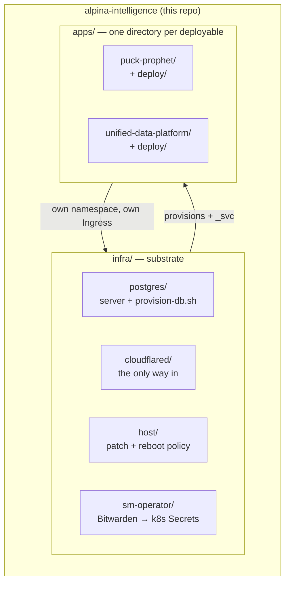

# Alpina Intelligence — monorepo

All projects in one repo: the shared infrastructure substrate, the apps that run on it,
and the libraries they share. Everything runs on one Hetzner VPS, reached only through a
Cloudflare tunnel, with k3s for apps and a shared Postgres for their data.

This lineage is a **deliberate restart**: the previous stack (the "UIP" monorepo — a Bun
workspace with every app, one big `docker-compose.yml`, and five deploy workflows) was
torn down. Its history is intact at the tag **`archive/uip-final`**, and the parts worth
learning from are copied into [`docs/reference/`](docs/reference/). Projects are ported
out of that tag into the layout below one at a time.

## Layout

```
infra/         # substrate: postgres, cloudflared, host, sm-operator, terraform (planned)
apps/          # deployable units, ANY language — each owns its Dockerfile + deploy/
packages-ts/   # shared TypeScript, consumed as source (Bun workspace)
packages-py/   # shared Python, alpina.* namespace (uv workspace) — created on first need
docs/          # architecture, ADRs, reference material from the previous stack
```

Apps are grouped **by deployable unit, not language** ([ADR-0002](docs/adr/0002-repo-layout.md)):
a TanStack Start app sits next to a Python service in `apps/`. TS members belong to the
Bun workspace rooted here; Python members to the uv workspace rooted here.

## The boundary

The substrate — the things every project shares and exactly one person should be able to
change — lives in `infra/`. Each app owns everything specific to itself:

| Concern | Owner |
| --- | --- |
| Postgres **server** — container, version, tuning, backups | **`infra/`** |
| Per-project database + role provisioning (needs superuser) | **`infra/`** |
| Cloudflare DNS, tunnel, Access — via Terraform | **`infra/`** (planned) |
| An app's image, manifests, schema, migrations, seed data | **`apps/<name>/`** |

The load-bearing rule: **the Postgres superuser password never leaves the substrate
tier.** It was never repo membership that enforced this — it's credential scoping: the
password lives in Bitwarden and on the host, `provision-db.sh` is run by hand, and no
app or CI environment ever holds it ([ADR-0001](docs/adr/0001-monorepo.md)).

So adding a project is a small, auditable PR touching `infra/` — once in that project's
lifetime, not once per deploy.



## Current state

- **Postgres 17** runs as a host Docker container managed by systemd, deliberately
  **outside** k3s and **outside** Terraform — see [`infra/postgres/`](infra/postgres/).
- **cloudflared** is the only inbound path to the box; no port but `:22` is open — see
  [`infra/cloudflared/`](infra/cloudflared/).
- **k3s** is installed and empty — no `Ingress` yet, so nothing is routable.
- **Secrets** come from Bitwarden Secrets Manager via `sm-operator` — see
  [`infra/sm-operator/`](infra/sm-operator/).
- **`apps/`, `packages-ts/`, and the workspace roots don't exist yet** — the monorepo
  decision is made ([ADR-0001](docs/adr/0001-monorepo.md),
  [ADR-0002](docs/adr/0002-repo-layout.md)); scaffolding is the next step, then projects
  are ported from `archive/uip-final`.

## Why the DB is outside the cluster

A single-node k3s StatefulSet buys all of Kubernetes' stateful complexity with none of
its HA payoff — there is no second node to fail over to. And the data is the part that
can't be rebuilt from git. So Postgres sits outside both the cluster's and Terraform's
destroy/apply blast radius, and apps reach it through a selector-less Service + manual
Endpoints so nothing hardcodes a host IP.
