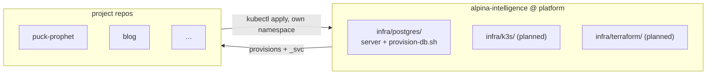

# Alpina Intelligence — platform

Shared infrastructure for the small fleet of projects running on one Hetzner VPS.
This branch is a **deliberate restart**: the previous stack (the "UIP" monorepo — a
Bun workspace with every app, one big `docker-compose.yml`, and five deploy workflows)
was torn down. Its history is intact at the tag **`archive/uip-final`**, and the parts
worth learning from are copied into [`docs/reference/`](docs/reference/).

## What lives here vs. in a project repo

This repo owns the **substrate** — the things every project shares and exactly one
person should be able to change:

| Concern | Owner |
| --- | --- |
| Postgres **server** — container, version, tuning, backups | **here** |
| Per-project database + role provisioning (needs superuser) | **here** |
| k3s cluster bootstrap | **here** (planned) |
| Cloudflare DNS, tunnel, Access — via Terraform | **here** (planned) |
| An app's image, manifests, schema, migrations, seed data | **its own repo** |
| An app's local dev database | **its own repo** |

The load-bearing rule: **the Postgres superuser password never leaves this tier.** If
each project provisioned its own database, every project would need superuser, and the
isolation between databases would only be as good as whoever remembered to apply it.

So adding a project is a small, auditable PR here — once in that project's lifetime,
not once per deploy.

## Current state

- **Postgres 17** runs as a host Docker container managed by systemd, deliberately
  **outside** k3s and **outside** Terraform — see [`infra/postgres/`](infra/postgres/).
- Everything else is still to come. Built up little by little, on purpose.

## Why the DB is outside the cluster

A single-node k3s StatefulSet buys all of Kubernetes' stateful complexity with none of
its HA payoff — there is no second node to fail over to. And the data is the part that
can't be rebuilt from git. So Postgres sits outside both the cluster's and Terraform's
destroy/apply blast radius, and apps reach it through a selector-less Service + manual
Endpoints so nothing hardcodes a host IP.
