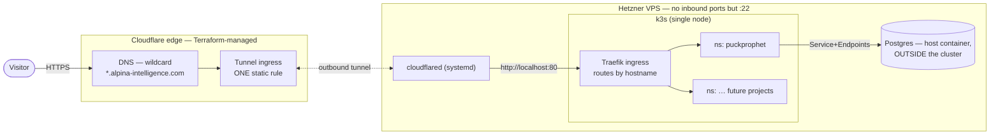
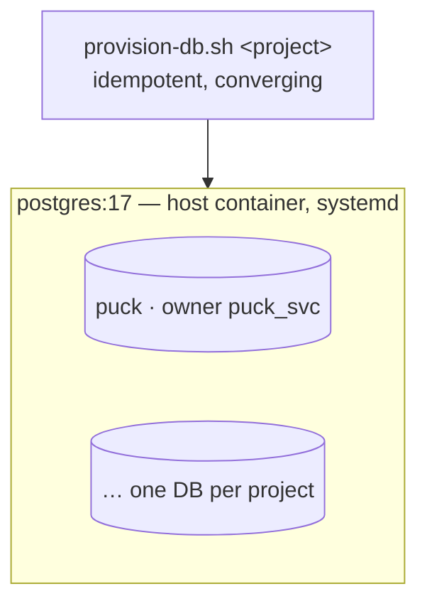
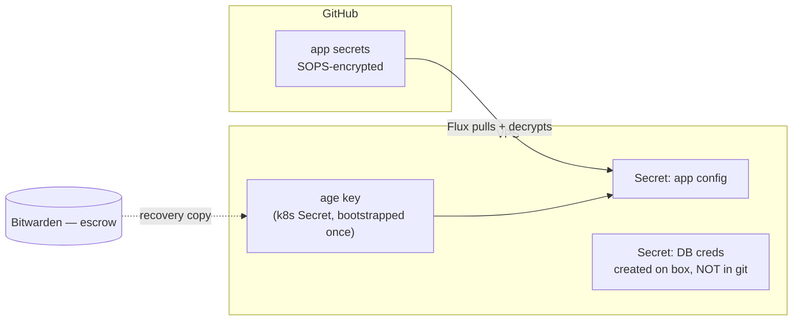

# Platform architecture

The shared substrate: one Hetzner VPS, reached only through a Cloudflare tunnel, running
k3s for apps and a shared Postgres for their data. Every project on the box depends on
what's described here; nothing here depends on any particular project.

> Status: **living doc.** Orchestration, infra-as-code and database placement are
> decided. Deploy mechanism and secret delivery are chosen but not built — see §6.

## 1. Two repos, one boundary

| Concern | Owner |
| --- | --- |
| Postgres **server** — container, version, tuning, backups | **this repo** |
| Per-project database + role provisioning (needs superuser) | **this repo** |
| k3s cluster bootstrap, ingress, secret encryption | **this repo** |
| Cloudflare DNS, tunnel, Access — via Terraform | **this repo** |
| An app's image, manifests, schema, migrations, seed data | **its own repo** |
| An app's local dev database | **its own repo** |

The rule that makes the split hold: **the Postgres superuser password never leaves this
tier.** If projects provisioned their own databases they'd each need superuser, and the
isolation between them would only be as good as whoever remembered to apply it.

Adding a project is therefore one small, auditable PR here — once in that project's
lifetime, not once per deploy.

## 2. System context

The key property: **no inbound ports are open** except `:22`. Cloudflare reaches the box
through an outbound-only tunnel, so the origin has no public IP surface to attack. This
constraint drives more decisions than anything else in this document.

**Why the tunnel and not an open port:** hostname routing already happens twice — at
Cloudflare's edge and again at the in-cluster ingress. A third reverse proxy on the host
would earn nothing. The tunnel keeps exactly one static rule; per-project routing lives
in each repo's `Ingress`.

## 3. Orchestration — k3s

Chosen over Docker Compose and Kamal on two grounds:

- **Multi-repo decoupling.** Each repo `kubectl apply`s into its own namespace and never
  edits a shared file. Port collisions are impossible, and routing moves out of the
  shared tunnel config into per-repo `Ingress` objects. This is the one dimension where
  Kubernetes' overhead earns its keep, and it's the direction the fleet is going.
- **Learning value.** Declarative manifests, real Deployments/Services/Secrets,
  GitOps-ready. Explicitly favouring durable patterns over shipping in the fewest steps.

**The tradeoff accepted:** a control plane babysitting a handful of containers, with more
that can wedge (CNI, ingress, kubelet). Taken on knowingly.

Installed: `v1.36.2+k3s1`, single node, bundled Traefik + ServiceLB. Klipper DNATs host
`:80/:443` via iptables — there is no listening socket in `ss`, which is confusing the
first time you look for one.

## 4. Postgres — shared, and outside the cluster

Two independent decisions that often get conflated.

**Outside the cluster**, because a single-node StatefulSet buys all of Kubernetes'
stateful complexity with none of its HA payoff — there's no second node to fail over to.
The data is the only thing here that can't be rebuilt from git, so it sits outside both
the cluster's and Terraform's destroy/apply blast radius. Apps reach it through a
selector-less Service + manual Endpoints, so nothing hardcodes a host IP.

**One shared instance**, because on a small box you pay `shared_buffers`, WAL and
autovacuum once instead of N times. Accepted costs: version upgrades become a coordinated
event across all projects, and a runaway project can disturb the others.

**Isolation is not free.** Postgres grants `CONNECT` to the `PUBLIC` pseudo-role on every
new database, so without an explicit revoke any project's credentials could open any
other project's database. `provision-db.sh` applies `REVOKE ALL ON DATABASE … FROM
PUBLIC` — that single line is what makes one shared instance safe for unrelated projects.
It also sets a per-role `CONNECTION LIMIT`, because `max_connections` is instance-wide and
one project leaking pool connections would otherwise starve the rest.

What it deliberately does *not* do: hide project names. Any role can read `pg_database`
and `pg_roles`. Fine when one person owns everything; not a tenancy boundary.

Details and runbook: [`infra/postgres/`](../infra/postgres/).

## 5. Infra as code — Terraform + Cloudflare

Everything on the shared layer is codified, so changes are PRs rather than hand-run API
calls.

- **Provider** `cloudflare/cloudflare`, version-pinned. Adopt the existing tunnel, wildcard
  DNS and Google IdP with `terraform import` — don't recreate. The v5 rewrite renamed many
  resources to `zero_trust_*` and changed nested field shapes; verify against v5 docs.
- **Auth:** a scoped API token, never the global key.
- **State:** R2 (already in the account, S3-compatible).
- **Deliberately excluded:** the Postgres host container. No infra change can touch the DB.

## 6. Secrets and deploy — decided, not yet built

### The constraint

With no inbound ports, **push-based CI has nowhere to push.** GitHub Actions can't reach
the k3s API on `:6443`, so its only route in is SSH — which means a root SSH key for the
box living in GitHub, the largest-blast-radius secret in the system. Pull-based deploy
needs no inbound access at all: a controller reaches out to git, same posture as
`cloudflared`. **That, not secret handling, is the argument for GitOps here.**

Chosen: **Flux** over Argo — ~100MB vs 400MB+, and no web UI to expose and protect.
Multi-repo is native: one `GitRepository`/`Kustomization` per project, registered here.

### Where secrets live

- **DB credentials** are generated on the box by `provision-db.sh`, written straight into
  a k8s Secret, and left **unmanaged by Flux** — the highest-value secret never reaches
  GitHub in any form. Cost: a cluster rebuild re-runs the provisioner, which you'd want
  anyway since rebuilding means rotating.
- **App config secrets** go in git encrypted with SOPS + age. Only values are encrypted,
  so diffs stay reviewable.
- **The age private key** is the one thing that must be guarded: bootstrapped into
  `flux-system` by hand, escrowed in Bitwarden, and **not regenerable** — losing it
  orphans every encrypted secret in git.

### The bootstrap secret is irreducible

Every scheme bottoms out in one credential placed out-of-band — an age key, a Sealed
Secrets keypair, an ESO machine token, a cloud KMS credential. You choose *what* it is,
not whether you have one. The consolation: one key is far easier to guard well than a
dozen passwords.

Note that encryption-at-rest (`--secret-encryption`, or disk encryption) protects
**backups and stolen disks**, not root on the box — the key sits beside the data. Root
compromise is the game-over event either way, which is why effort belongs on anything
that copies bytes *off* the box.

### Order of work

1. `provision-db.sh --k8s-secret` / `--no-file` — kills plaintext files on the box, no new
   components.
2. Enable `--secret-encryption` **before** the first Secret exists, so there's nothing to
   re-encrypt.
3. Deploy the first app with plain manifests applied by hand — learn the objects before
   adding a reconciliation loop over them.
4. Then Flux + SOPS. Same Secret names, same `secretKeyRef`, so app manifests don't
   change. That's what makes deferring it safe rather than a rewrite.

## 7. Open questions

1. ~~Orchestration~~ → k3s ✅ · ~~Postgres placement~~ → host, shared ✅ · ~~deploy
   mechanism~~ → Flux ✅
2. **Rebind Postgres** from `127.0.0.1` to a pod-reachable node IP; add the Service +
   Endpoints. Blocking the first app deploy.
3. **Registry** — GHCR vs Cloudflare's.
4. **Backups** — per-database `pg_dump` → R2, plus `pg_dumpall --globals-only` for roles.
   Encrypt them: they leave the box. Do before real traffic.
5. **Terraform bootstrap** — provider pin, R2 backend, import tunnel + DNS, then flip the
   tunnel from its `http_status:404` catch-all to one static rule → `localhost:80`.
6. **Tear down** the `whoami-test` workload still running in k3s.
