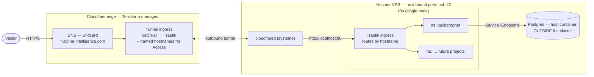
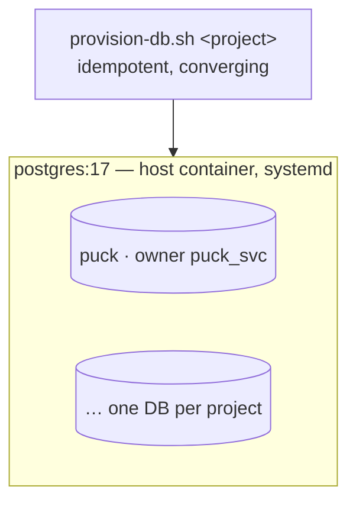
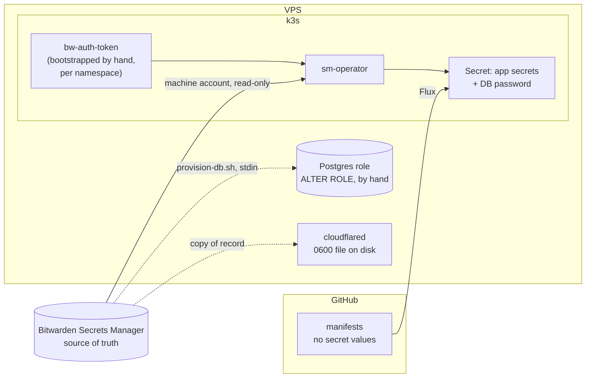

# Platform architecture

The shared substrate: one Hetzner VPS, reached only through a Cloudflare tunnel, running
k3s for apps and a shared Postgres for their data. Every project on the box depends on
what's described here; nothing here depends on any particular project.

> Status: **living doc.** Orchestration, routing, infra-as-code and database placement
> are decided. Deploy mechanism and secret delivery are chosen but not built — see §7.

## 1. One repo, one boundary

Originally two tiers in two *repos* — this substrate, plus one repo per app. Consolidated
into a monorepo 2026-08-10 (ADR-0001): same boundary, now a directory seam instead of a
repo seam.

| Concern | Owner |
| --- | --- |
| Postgres **server** — container, version, tuning, backups | **`infra/`** |
| Per-project database + role provisioning (needs superuser) | **`infra/`** |
| k3s cluster bootstrap, ingress, secret encryption | **`infra/`** |
| Cloudflare DNS, tunnel, Access — via Terraform | **`infra/`** |
| An app's image, manifests, schema, migrations, seed data | **`apps/<name>/`** |
| An app's local dev database | **`apps/<name>/`** |

The rule that makes the split hold is unchanged: **the Postgres superuser password never
leaves the substrate tier.** It lives in Bitwarden and on the host, is used by a hand-run
`provision-db.sh`, and never enters CI or any app's environment. Repo membership never
enforced that rule — credential scoping did, and still does.

Adding a project is therefore one small, auditable PR touching `infra/` — once in that
project's lifetime, not once per deploy.

## 2. System context

The key property: **no inbound ports are open** except `:22`. Cloudflare reaches the box
through an outbound-only tunnel, so the origin has no public IP surface to attack. This
constraint drives more decisions than anything else in this document.



**Why the tunnel and not an open port:** hostname routing already happens twice — at
Cloudflare's edge and again at the in-cluster ingress. A third reverse proxy on the host
would earn nothing. Where each routing decision lives is §3.

## 3. Routing — tunnel, Traefik, Access

### The layers

| Layer | Decides | Configured in |
| --- | --- | --- |
| DNS — `*.alpina-intelligence.com` | which tunnel a hostname reaches | Terraform (this repo) |
| Tunnel ingress | which local address a request goes to | Terraform (this repo) |
| Traefik | which Service a hostname maps to | an `Ingress` in **the app's `deploy/` directory** |

The wildcard is proxied CNAME → `<tunnel-id>.cfargotunnel.com`, so a new subdomain
resolves with no DNS change at all, and **no `A` record for the box exists in the zone** —
the origin IP is genuinely unpublished.

`http://localhost:80` is subtler than it looks: nothing *listens* there. k3s's ServiceLB
(klipper) DNATs host `:80/:443` into the Traefik pod with iptables rules, so `ss` shows no
socket. Expect to be confused by that once.

### Routing lives in Ingress, not in the tunnel

`cloudflared` can route by hostname — that's how most tunnels are used — and it was
rejected here. Doing so needs a stable local address per app, which means either
hand-allocated NodePorts (a number to keep in sync between the tunnel config and every
app, forever) or ClusterIPs
you don't control. Only one Service can own host `:80`, which is the collision an ingress
controller exists to resolve. And Traefik is already watching the API server doing exactly
this job for free.

The rule that follows: **adding an app touches one directory.** An app ships its own
`Ingress` in `apps/<name>/deploy/`; the shared tunnel config doesn't move.

### Cloudflare Access needs a named hostname

The exception that shapes the design. Access policies attach to a **public hostname on the
tunnel** — a bare catch-all has no hostname to scope a policy to. So the ingress list is a
hybrid: named entries exist *only* to give Access something to bind to, and still point at
the same place.

```yaml
ingress:
  - hostname: admin.alpina-intelligence.com
    service: http://localhost:80      # + Access policy on this hostname
  - service: http://localhost:80      # everything else → Traefik → per-app Ingress
```

Both go to Traefik; hostname routing is still Traefik's job. Shared config therefore
changes when an **auth boundary** is added, not when an app is. The Google IdP
(`72d86760-df75-4b64-b250-c88251fd8505`) is already provisioned for this.

**Access enforces at the edge, not on the box.** A request that reaches Traefik by any
other path is unauthenticated — mitigated by there being no other path (no inbound ports),
but it means Traefik must never become reachable directly. For anything genuinely
sensitive, the app should also verify the `Cf-Access-Jwt-Assertion` header rather than
trusting that it was fronted.

### No TLS inside the box

The edge terminates HTTPS and holds the `*.alpina-intelligence.com` certificate, so
nothing here runs certbot or cert-manager. Edge → `cloudflared` is encrypted; everything
after it — `cloudflared` → Traefik → pod — is plaintext over loopback and the cluster
network. Fine on a single node, and another reason the firewall's default-deny is load
bearing rather than belt-and-braces.

Connector details and the runbook: [`infra/cloudflared/`](../infra/cloudflared/).

## 4. Orchestration — k3s

Chosen over Docker Compose and Kamal on two grounds:

- **Per-app decoupling.** Each app `kubectl apply`s (later: Flux-reconciles) its own
  `deploy/` directory into its own namespace and never edits a shared file. Port
  collisions are impossible, and routing lives in per-app `Ingress` objects instead of
  the shared tunnel config. This is the one dimension where Kubernetes' overhead earns
  its keep — it's what lets one repo hold many apps without their deploys coupling.
- **Learning value.** Declarative manifests, real Deployments/Services/Secrets,
  GitOps-ready. Explicitly favouring durable patterns over shipping in the fewest steps.

**The tradeoff accepted:** a control plane babysitting a handful of containers, with more
that can wedge (CNI, ingress, kubelet). Taken on knowingly.

Installed: `v1.36.2+k3s1`, single node, bundled Traefik + ServiceLB. Klipper DNATs host
`:80/:443` via iptables — there is no listening socket in `ss`, which is confusing the
first time you look for one.

## 5. Postgres — shared, and outside the cluster

Two independent decisions that often get conflated.

**Outside the cluster**, because a single-node StatefulSet buys all of Kubernetes'
stateful complexity with none of its HA payoff — there's no second node to fail over to.
The data is the only thing here that can't be rebuilt from git, so it sits outside both
the cluster's and Terraform's destroy/apply blast radius. Apps reach it through a
selector-less Service + manual Endpoints, so nothing hardcodes a host IP.

**One shared instance**, because on a small box you pay `shared_buffers`, WAL and
autovacuum once instead of N times. Accepted costs: version upgrades become a coordinated
event across all projects, and a runaway project can disturb the others.



**Isolation is not free.** Postgres grants `CONNECT` to the `PUBLIC` pseudo-role on every
new database, so without an explicit revoke any project's credentials could open any
other project's database. `provision-db.sh` applies `REVOKE ALL ON DATABASE … FROM
PUBLIC` — that single line is what makes one shared instance safe for unrelated projects.
It also sets a per-role `CONNECTION LIMIT`, because `max_connections` is instance-wide and
one project leaking pool connections would otherwise starve the rest.

What it deliberately does *not* do: hide project names. Any role can read `pg_database`
and `pg_roles`. Fine when one person owns everything; not a tenancy boundary.

Details and runbook: [`infra/postgres/`](../infra/postgres/).

## 6. Infra as code — Terraform + Cloudflare

Everything on the shared layer is codified, so changes are PRs rather than hand-run API
calls.

- **Provider** `cloudflare/cloudflare`, version-pinned. Adopt the existing tunnel, wildcard
  DNS and Google IdP with `terraform import` — don't recreate. The v5 rewrite renamed many
  resources to `zero_trust_*` and changed nested field shapes; verify against v5 docs.
- **Auth:** a scoped API token, never the global key. It lives in CI, never on the box.
- **State:** R2 (already in the account, S3-compatible). **State holds secrets in
  plaintext** — importing the tunnel *resource* would put the connector token in it, so
  import only `..._tunnel_cloudflared_config` and the DNS record and leave the tunnel
  itself unmanaged. It's a create-once object that will never be modified. Bucket stays
  private with tightly scoped keys either way; this concentrates credentials rather than
  eliminating them. Locking needs `use_lockfile = true` (the old S3 backend wanted
  DynamoDB) — **verify against R2** during bootstrap rather than during a race.
- **Runs locally first, CI after.** The initial import is iterative — plan, see an
  unexpected diff, adjust HCL, repeat — which is miserable through CI round-trips. Once
  `plan` is clean against reality: PR → `plan` as a comment, merge → `apply`. A separate
  workflow from any app's deploy pipeline; infra changes monthly, apps change constantly.
- **Deliberately excluded:** the Postgres host container. No infra change can touch the DB.

## 7. Secrets and deploy — decided, not yet built

### The constraint

With no inbound ports, **push-based CI has nowhere to push.** GitHub Actions can't reach
the k3s API on `:6443`, so its only route in is SSH — which means a root SSH key for the
box living in GitHub, the largest-blast-radius secret in the system. Pull-based deploy
needs no inbound access at all: a controller reaches out to git, same posture as
`cloudflared`. **That, not secret handling, is the argument for GitOps here.**

Chosen: **Flux** over Argo — ~100MB vs 400MB+, and no web UI to expose and protect.
One `GitRepository` (this repo) plus a path-scoped `Kustomization` per app
(`path: ./apps/<name>/deploy`), registered in `infra/` — the monorepo equivalent of the
original per-repo registration.

### Registry — GHCR

Images go to `ghcr.io`, private, one package per project. CI already runs in GitHub
Actions, so `GITHUB_TOKEN` pushes with no extra credential; the cluster pulls with a single
`imagePullSecret`. GitHub currently charges nothing for container storage or bandwidth, and
Actions pulls don't count against the hosting repo either way.

**Cloudflare's registry was evaluated and doesn't fit** — worth recording so it isn't
re-litigated. `registry.cloudflare.com` is plumbing for Cloudflare Containers: you push
with `wrangler containers push` and *Cloudflare's* runtime pulls, with auth handled
implicitly on both ends. There's no supported path for an arbitrary external client to pull
from it (even `vite dev` can't). Using it would mean adopting Cloudflare Containers as the
runtime instead of k3s — a different deployment model, not a different registry. Same shape
of answer for Cloudflare's Secrets Store, and Cloudflare hosts no git at all: Workers Builds
connects *to* GitHub and only deploys Workers.

Neither choice moves a trust boundary. The source already lives on GitHub, and Cloudflare
already terminates TLS for every request. The control that matters is package
visibility — set it private explicitly rather than inheriting a default.

### Where secrets live — Bitwarden Secrets Manager (revised 2026-08-02)

**This supersedes SOPS + age**, which earlier versions of this document specified. The
change is that Bitwarden is now the *source of truth* rather than an escrow copy, and no
app secret is stored in git in any form — not even encrypted.

`sm-operator` runs in-cluster, authenticates with a Bitwarden machine account, and
reconciles `BitwardenSecret` CRs into ordinary k8s Secrets on a 300s timer. Deployment
manifests reference those by `secretKeyRef` and never know Bitwarden exists. Runbook:
`infra/sm-operator/README.md`.



Why this over SOPS: rotation stops being a git commit. With SOPS, changing a password means
re-encrypting, committing, pushing, and waiting for reconciliation — so a rotation is a code
change, and the *encrypted history stays in git forever*, decryptable by anyone who ever
obtains the age key. With a secrets manager the old value is simply gone.

What it costs, recorded honestly: git no longer shows when a secret changed. That audit
trail moves into Bitwarden's event log — which is a Teams-tier feature, and part of why the
machine-account budget pushes to a paid tier rather than being incidental.

- **App secrets** sync from Bitwarden, `onlyMappedSecrets: true` so the CR lists them
  explicitly rather than inheriting whatever the machine account can see.
- **DB credentials sync from Bitwarden too** (revised same day, superseding "generated on
  the box and never synced"). The earlier split kept the database password off Bitwarden to
  narrow blast radius, and it didn't survive contact: `provision-db.sh` ended with *"now
  copy this into Bitwarden"*, so the value existed in two places with a human step between
  them — and `--rotate` invalidated the copy silently. **A manual sync step is not a
  security control, it's a drift generator.** The script now takes the password on stdin and
  stores nothing; Bitwarden is authoritative and the host keeps no plaintext file.

  The cost, kept rather than dropped: a stolen `bw-auth-token` now reaches the database.
  Accepted because that token and the k8s Secret holding the same password live in the same
  namespace — anyone who can read one can already read the other. The exposure genuinely
  added is a token obtained *without* cluster read access, which is narrower than the
  failure mode it removes.
- **Host secrets** — the cloudflared connector token, Postgres passwords — are outside the
  cluster and the operator cannot reach them. They stay `0600` files with Bitwarden as
  vault of record. Deliberate: making cloudflared depend on reaching `bitwarden.com` before
  it can start puts a network dependency on the one service that recovers you from network
  problems.

### Non-secret config is not a secrets problem

`PORT`, `NODE_ENV`, hostnames: ConfigMap or literal `env:` in the Deployment, reviewable in
git. A secrets manager used as a config store adds a moving part between a change and
production for nothing. `TZ=UTC` is a special case — it belongs in the Dockerfile, because
it's a property of the image and too load-bearing to be forgettable in a manifest.

Both ConfigMaps and Secrets share one trap: **env vars freeze at process start.** Neither a
sync nor an edit changes a running pod, so every rotation ends in `kubectl rollout restart`.
Until that runs, the rotation has happened everywhere except where it matters.

Anything reaching the *browser* is a third category again — Vite inlines it at build time,
so it's set in CI when the image is built and cannot be secret by construction.

### The bootstrap secret is irreducible

Every scheme bottoms out in one credential placed out-of-band — an age key, a Sealed
Secrets keypair, a machine-account token, a cloud KMS credential. You choose *what* it is,
not whether you have one. Moving to Bitwarden changed which secret it is, not that there is
one. The consolation: one credential is far easier to guard well than a dozen passwords.

Two properties make the machine token the better choice than an age key, though: it is
read-only and revocable from a dashboard, and it is **regenerable**. Losing the age key
orphaned every encrypted secret in git permanently; losing the token means minting a new
one.

Note that encryption-at-rest (`--secret-encryption`, or disk encryption) protects
**backups and stolen disks**, not root on the box — the key sits beside the data. Root
compromise is the game-over event either way, which is why effort belongs on anything
that copies bytes *off* the box.

### Machine accounts

One per consumer, each scoped to the minimum projects, because the scope *is* the access
control — a `BitwardenSecret` can only surface what its token already reads.

| Account | Reads | Used by |
| --- | --- | --- |
| cluster | `platform`, `puckprophet` | `sm-operator` in k3s |
| `github-ci-puckprophet` | `puckprophet` | GitHub Actions, via `bitwarden/sm-action` |

The count matters: machine accounts are budgeted per tier, and the third or fourth is what
tips this into Teams at $6/user/mo. That's the same spend that restores the audit log given
up by moving secrets out of git, so it's one decision, not two.

### Order of work

1. ~~`provision-db.sh --k8s-secret` / `--no-file`~~ → done differently: the script now takes
   the password on **stdin** and writes no file, with Bitwarden as the source.
2. Enable `--secret-encryption` **before** the first Secret exists, so there's nothing to
   re-encrypt.
3. Install `sm-operator` and prove one secret round-trips, including a deliberate rotation
   test. Do this before anything depends on it — the pre-v2.1.0 failure mode was a sync that
   silently stopped after the first success.
4. Deploy the first app with plain manifests applied by hand — learn the objects before
   adding a reconciliation loop over them.
5. Then Flux. Same Secret names, same `secretKeyRef`, so app manifests don't change. That's
   what makes deferring it safe rather than a rewrite.

## 8. Paths not taken (yet)

Evaluated 2026-08-01. None of it is wrong for us later — it's recorded so the reasoning
doesn't have to be rebuilt.

### What this architecture actually buys

Worth stating, because "a VPS in 2026" sounds like the boring choice rather than a chosen
one. The tunnel puts **Cloudflare's edge in front of an origin we still control**: CDN,
TLS termination, DDoS absorption and caching, without giving up the runtime. And app and
database are **colocated** — loaders query Postgres over loopback, sub-millisecond. That is
the exact problem serverless-at-the-edge has to solve with connection pooling, query
caching and placement hints (Cloudflare's own figures: 1–3 ms per query when a Worker is
pinned near its database, 20–30 ms when it isn't). For loader-driven SSR making several
sequential queries, colocation beats both, with no configuration.

Everything else follows from fixed-cost, unmetered compute: argon2 hashing and SSR are free
once the box is paid for, any runtime and any duration is permitted (the planned Python
model tier, batch scoring, cron), and project #2 is a database provision plus a namespace
rather than a new bill.

Accepted in exchange: one node, no HA, vertical scaling only, and we own patching and
backups.

### Cloudflare Workers instead of k3s

Viable for the web tier — TanStack Start is explicitly supported by
`@cloudflare/vite-plugin` (`viteEnvironment: { name: "ssr" }`), and SSR suits an isolate
fine because SSR was already stateless per request. What a Worker gives up is *process*
memory, and each use has a named replacement: pools → Hyperdrive, caches → KV/Cache API,
rate limits and realtime → Durable Objects, background work → Queues/Workflows, scheduling
→ Cron Triggers. Sessions are already cookie-based here, so that part is unchanged.

Two things stop it being a straight win:

- **The Python model tier.** Workers is JS/WASM; arbitrary runtimes mean Cloudflare
  Containers, which is orchestration again — someone else's. Training also doesn't fit
  request-scoped compute (Cron Triggers cap at 15 minutes).
- **Edge SSR against a central database isn't actually "edge."** Cloudflare's own guidance
  is to pin execution near the data (`placement.region`, or `mode: "smart"`). That
  converges on a regional server you don't operate — a real benefit, but not the
  runs-in-330-cities story. Static and cached responses genuinely do go global.

CPU limits are not the obstacle people expect: CPU time excludes waiting on I/O, and Paid
allows 30 s (up to 5 min). The Free tier's 10 ms is what rules it out for SSR. The one real
cost is argon2 password hashing — deliberately CPU-expensive, and on Workers you pay for it
per sign-in.

### If it ever moves, the database is the decision

| Option | Code change | Cost | Still run a box? |
| --- | --- | --- | --- |
| D1 | SQLite: rewrite schema to `sqlite-core`, **lose `timestamptz`** | Free tier is real | No |
| PlanetScale Postgres (via Hyperdrive, billed by Cloudflare) | None | Paid, billed daily whether queried or not | No |
| Keep this Postgres, reached by Hyperdrive + Workers VPC over **this tunnel** | None | None | Yes |

D1's read replication suits the workload conceptually — read-heavy, batch writes, and
because predictions are **written once and never overwritten**, replicated rows are
immutable, so replica lag can only ever mean "not visible yet", never "mutated out of
order". It still costs `timestamptz`, which the app tier treats as load-bearing.

### The cheaper lever is caching, not placement

Most of this app's surface is public and identical for every visitor. Caching rendered
output removes the database from the hot path entirely — a cache hit doesn't run a Worker
or reach an origin at all. On *this* topology it's better than that: **a cache hit never
traverses the tunnel**, so it costs no connector capacity, no Traefik, no pod, no Postgres.
On a single node behind a single connector, edge caching is most of capacity planning.

The precondition is already in the app: its `_public` route group must never depend on a
session, which is exactly what makes those routes safe to cache. Rule shape: cache
`_public`, bypass when a session cookie is present. `Set-Cookie` responses are safe by
default — Origin Cache Control is Enterprise-only to disable and is *on* for everyone else,
which means such responses are simply not cached.

Zone state as of 2026-08-01: Cache Level **Standard**, Browser Cache TTL switched from 4
hours to **Respect Existing Headers** (so the app's headers decide, which is the right
layer), and **no custom Cache Rules exist** — 3 rulesets, none of `kind: "zone"`. Cache
rules are shared-layer config and belong in Terraform, so the token needs **Zone Settings**
alongside DNS and tunnel scope.

### Portability is the quiet argument

The Dockerfile isn't only for k3s. ACA, Cloud Run, Fly and Render all consume the same OCI
image, so shedding the ops burden later is a config change, not a rewrite. Workers is the
one target not reachable from that artifact — which is why "move to ACA" is an afternoon
and "move to Workers" is a project. Either way the schema, migrations, write-once rule and
route-group split survive intact.

## 9. Open questions

1. ~~Orchestration~~ → k3s ✅ · ~~Postgres placement~~ → host, shared ✅ · ~~deploy
   mechanism~~ → Flux ✅ · ~~tunnel config management~~ → remote, Terraform-owned ✅ ·
   ~~where routing lives~~ → per-app `Ingress`, named tunnel hostnames only for Access ✅ ·
   ~~registry~~ → GHCR ✅ · ~~host patching~~ → scheduled auto-reboot ✅
2. **Rebind Postgres** from `127.0.0.1` to a pod-reachable node IP; add the Service +
   Endpoints. Blocking the first app deploy.
3. ~~**Where CI's infra credentials live**~~ → **Bitwarden Secrets Manager**, resolved
   2026-08-02 (§7). CI pulls `CLOUDFLARE_API_TOKEN` and the R2 state keys with
   `bitwarden/sm-action` under the `github-ci-puckprophet` machine account, so nothing is
   duplicated into GitHub Actions secrets and there is one place to rotate. Remaining:
   confirm the Teams-tier spend that the machine-account count and the audit log both
   depend on. Cloudflare's Secrets Store was never a candidate — like their registry, it
   feeds Cloudflare's runtime, not a k3s cluster on our own box.
4. **Backups** — per-database `pg_dump` → R2, plus `pg_dumpall --globals-only` for roles.
   Encrypt them: they leave the box. Do before real traffic.
5. **Terraform bootstrap** — provider pin, R2 backend, import the wildcard record,
   `cloudflare_zero_trust_tunnel_cloudflared_config` (currently version 6, a lone
   `http_status:404`) **and the zone's cache configuration**, then flip the catch-all to
   `http://localhost:80`. Import cache settings in the same first apply so it captures the
   whole edge config rather than two-thirds of it — see §8. Gated on minting
   the scoped `CLOUDFLARE_API_TOKEN`. The cluster now has **no** `Ingress` at all
   (`whoami-test` torn down 2026-08-01 — it had claimed
   `puckprophet.alpina-intelligence.com`, so flipping the catch-all would have served a
   test container at the real hostname), so the flip is safe whenever the token exists.
6. **Non-security package upgrades** still accumulate (47 pending as of 2026-08-01) and are
   applied by hand. Deliberate — same reasoning as `--no-autoupdate` on cloudflared — but
   worth a periodic sweep rather than never.
