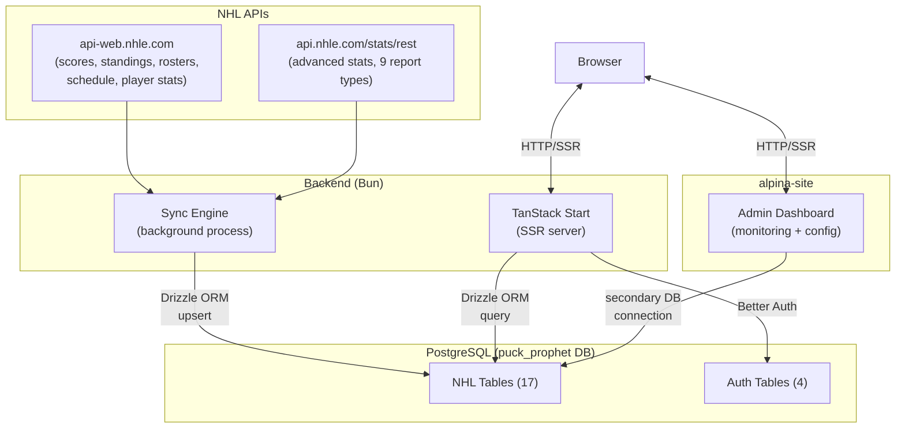
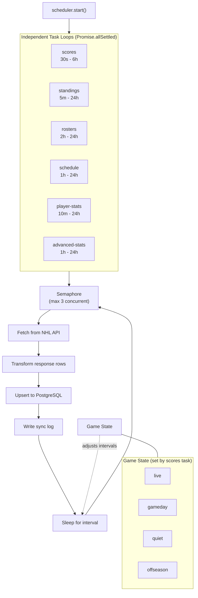
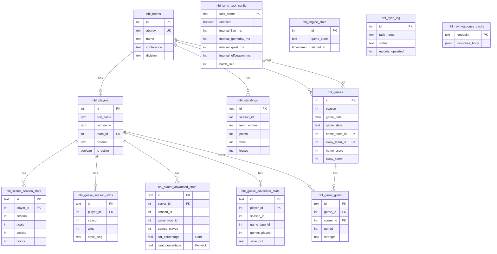
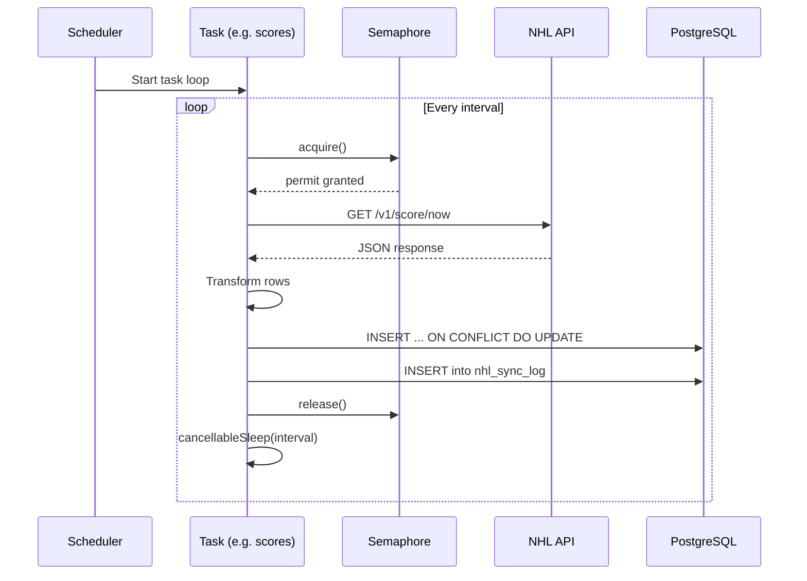

# Puck Prophet Architecture

## Overview

Puck Prophet is an NHL hockey pool management app. It continuously syncs data from the NHL's public APIs into PostgreSQL, then serves a TanStack Start (SSR React) frontend for pool management, leaderboards, and live scores.

## High-Level Architecture



## Sync Engine

The sync engine runs as a standalone background process (`src/sync/index.ts`). It uses a concurrent scheduler with independent task loops and a counting semaphore for concurrency control.



### Tasks

| Task | Source API | Target Tables | Key Behavior |
|------|-----------|---------------|--------------|
| `scores` | `/v1/score/now` | `nhl_games`, `nhl_game_goals` | Sets game state; fastest polling |
| `standings` | `/v1/standings/now` | `nhl_standings` | Full league standings |
| `rosters` | `/v1/roster/{team}/current` | `nhl_players` | Batch processes all 32 teams |
| `schedule` | `/v1/schedule/now` | `nhl_games` | Upcoming game schedule |
| `player-stats` | `/v1/player/{id}/landing` | `nhl_skater_season_stats`, `nhl_goalie_season_stats` | Per-player, batch of 10 |
| `advanced-stats` | `/stats/rest/en/skater/{report}`, `/stats/rest/en/goalie/{report}` | `nhl_skater_advanced_stats`, `nhl_goalie_advanced_stats` | 9 reports, paginated, per-report upserts |

### Key Mechanisms

- **DB-backed config**: Task intervals, enabled state, and batch sizes stored in `nhl_sync_task_config`. Read each cycle with 30s cache TTL. Falls back to hardcoded defaults if table is empty.
- **Concurrency**: Counting semaphore with FIFO waiter queue limits parallel task execution
- **Cancellation**: `cancellableSleep()` with `AbortController` enables clean shutdown on SIGINT/SIGTERM
- **Error handling**: Exponential backoff per task (up to 5 min), errors logged to `nhl_sync_log`
- **Batch processing**: `batchProcess()` utility for within-task parallelism (rosters: 8, player-stats: 10)
- **Pagination**: `fetchAllPages()` loops until `data.length < PAGE_SIZE` for stats REST API
- **Monitoring**: Engine state (game state + uptime) persisted to `nhl_engine_state`. Admin dashboard in alpina-site reads config and sync logs via secondary DB connection.

## Database Schema



### System Tables

- **`nhl_sync_task_config`** -- DB-backed task configuration (intervals per game state, enabled toggle, batch size). Read by the scheduler each cycle.
- **`nhl_engine_state`** -- Single-row table tracking current game state and engine start time. Written by the scheduler, read by the monitoring dashboard.
- **`nhl_sync_log`** -- Audit trail for every sync task run (status, duration, record count, errors)
- **`nhl_raw_response_cache`** -- Last raw API response per endpoint (planned: archive to S3-compatible object storage)

### Auth Tables (Better Auth)

| Table | Purpose |
|-------|---------|
| `user` | User accounts |
| `session` | Active sessions |
| `account` | OAuth/credential accounts |
| `anonymous_session` | Guest sessions (anonymous plugin) |

## Data Flow



## Frontend

### Routing (TanStack Start, file-based)

| Route | File | Description |
|-------|------|-------------|
| `/` | `routes/index.tsx` | Home / landing page |
| `/dashboard` | `routes/dashboard.tsx` | User dashboard |
| `/leaderboard` | `routes/leaderboard.tsx` | Pool leaderboard |
| `/api/auth/$` | `routes/api/auth/$.ts` | Better Auth catch-all API |

### Component Structure

```
src/components/
├── auth/           # SignInForm, SignUpForm
├── pools/          # PoolCard, PoolList
├── leaderboard/    # LeaderboardTable, LeaderboardRow, RankBadge
├── PuckProphet/    # ProphetCharacter, ProphetQuote, PredictionCard
├── ui/             # shadcn/ui (button, card, table, tabs, etc.)
├── Header.tsx
└── ThemeSwitcher.tsx
```

## Tech Stack

| Technology | Role |
|-----------|------|
| **Bun** | Runtime, package manager, script runner |
| **TanStack Start** | Full-stack React framework with SSR |
| **React 19** | UI library |
| **Tailwind CSS v4** | Utility-first styling |
| **shadcn/ui** | Component library |
| **Drizzle ORM** | Type-safe database queries and migrations |
| **PostgreSQL** | Primary data store |
| **Better Auth** | Authentication (email/password + anonymous) |
| **Vitest** | Unit and integration testing |
| **Biome** | Linting and formatting |
| **Storybook** | Component development and documentation |
